# knowledge-agents

An AI-powered personal knowledge management system that helps you query and understand your notes using semantic search and intelligent agents.

## Table of Contents

- **Looking for setup instructions?** → See [Setup Instructions](#setup-instructions) section
- **Want to understand the architecture?** → See [Architecture](#architecture) section
- **Need to understand the API endpoints?** → See [API Endpoints](#api-endpoints) section
- **Want to see the completion status?** → See [Completion Status](#completion-status) section
- **Need quick start commands?** → See [Quick Start](#quick-start) section
- **Want to add a new model?** → See [Model Onboarding Guide](docs/MODEL_ONBOARDING.md)
- **Want to verify Responses API usage?** → See [Verifying Responses API](docs/VERIFYING_RESPONSES_API.md)

## Overview

Knowledge-agents is a production-ready system for querying and managing personal notes using semantic search and OpenAI agents. Ask natural language questions about your notes, and the system intelligently finds relevant information and synthesizes comprehensive answers. Built with modern Python frameworks, Docker, and best practices for maintainability and scalability.

## Features

- **🤖 AI-Powered Note Queries**: Ask natural language questions about your notes and get intelligent, context-aware answers
- **🔍 Semantic Search**: Vector-based search using Qdrant for finding relevant notes based on meaning, not just keywords
- **🛡️ Guardrails**: Input validation and output quality assessment to ensure reliable, high-quality responses
- **📊 Monitoring**: Comprehensive Prometheus metrics and health checks for observability
- **🗄️ Database Integration**: PostgreSQL for structured note data with efficient querying
- **🔗 NotePlan Integration**: Seamless integration with NotePlan, generating x-callback-url links for easy navigation
- **⚡ Usage Tracking**: Configurable token usage reporting with detailed metadata in response headers
- **🔧 Modular Architecture**: Clean separation of concerns with well-organized utility modules

## Setup Instructions

**Before running anything, you MUST provide your LiteLLM proxy API key:**

```bash
# Add LiteLLM API key
mkdir -p secrets
echo "sk-1234" > secrets/admin_api_key.txt  # Default admin key
# Or use your generated key from make litellm-generate-key
```

**The system uses LiteLLM proxy pointing to LM Studio for local LLM access.**

## Quick Start

### Prerequisites

- Docker and Docker Compose
- Make
- OpenAI API key (or LiteLLM proxy configured)

### Starting the Stack

From the root of this repo, run the following:

```bash
# Setup
make build                     # Build Containers
make start                     # Start Docker Compose Stack (PostgreSQL, Qdrant, LiteLLM Proxy)
make db-seed                   # Seed database with Plans/Buckets/Tasks and vector store from NotePlan files

# Call API
curl -X POST http://localhost:8000/api/v1/notes/query \
  -H "Content-Type: application/json" \
  -d '{"query": "What are my tasks for today?"}'
```

### Test the API

```bash
# Test note query API
make test-api QUERY="What notes do I have about genai?"

# Check health
curl http://localhost:8000/health

# View metrics
curl http://localhost:8000/metrics
```

## Architecture

### Core Components

- **FastAPI Application**: REST API for note queries
- **OpenAI Agents**: Intelligent answer synthesis from notes
- **Qdrant Vector Store**: Semantic search for finding relevant notes
- **PostgreSQL**: Structured note data (Plans, Buckets, Tasks)
- **LiteLLM Proxy**: Unified LLM access and routing
- **Prometheus**: Metrics collection and monitoring

### API Endpoints

- **`POST /api/v1/notes/query`** - Query notes with natural language questions
- **`GET /health`** - Health check with service status
- **`GET /metrics`** - Prometheus metrics

### Folder Structure

```
src/knowledge_agents/
├── main.py                    # FastAPI app
├── routers/                   # API routes (note_query.py)
├── agents/                    # OpenAI agents (note_query_agent.py)
├── guardrails/                # Input/output validation
├── services/                  # Business logic (note_query_service.py)
├── database/                  # Database models (Plan, Bucket, Task)
└── utils/                     # Vector store utilities

src/notes/                     # NotePlan parsing package
├── parser.py                  # Markdown parsing
├── traversal.py               # File discovery
├── filter.py                  # File filtering
└── generators.py              # Content generators
```

### High Level Solution Description

- **Language**: Python
- **Framework**: [FastAPI](https://fastapi.tiangolo.com/) with [OpenAI agents](https://openai.github.io/openai-agents-python/)
- **LLM**: LiteLLM proxy connecting to LM Studio (local models)
- **Vector Store**: Qdrant for semantic search
- **Database**: PostgreSQL with SQLAlchemy ORM

### Note Query Agent Architecture (Happy Path)

```mermaid
flowchart LR
    subgraph "Input"
        INPUT["User Query<br/>'What notes do I have about genai?'"]
    end

    subgraph "Input Guardrails"
        IG["Note Query Guardrail<br/>Validates query is about notes"]
    end

    subgraph "Retrieval (RAG)"
        VEC["Semantic Vector Search<br/>(Qdrant + OpenAI Embeddings)<br/>Top-N relevant note files"]
    end

    subgraph "Agent"
        AGENT["Note Query Agent<br/>(Synthesizes answer from notes)"]
    end

    subgraph "MCP Tools"
        MCP["tidy-mcp Service<br/>• NotePlan x-callback-url<br/>• File path conversion"]
    end

    subgraph "Output Guardrails"
        JUDGE["Judge Answer Quality<br/>Validates answer quality"]
    end

    subgraph "Response"
        RESPONSE["Response JSON<br/>answer, reasoning,<br/>relevant_files, NotePlan links"]
    end

    %% Flow
    INPUT --> IG --> VEC --> AGENT --> JUDGE --> RESPONSE
    AGENT -.->|"function_tool"| MCP
    MCP -.->|"x-callback-url links"| AGENT

    %% Styling
    classDef inputStyle fill:#e3f2fd
    classDef guardrailStyle fill:#f3e5f5
    classDef agentStyle fill:#e8f5e8
    classDef outputStyle fill:#fff3e0
    classDef responseStyle fill:#e0f2f1
    classDef ragStyle fill:#e1f5fe
    classDef mcpStyle fill:#e8eaf6

    class INPUT inputStyle
    class IG,JUDGE guardrailStyle
    class AGENT agentStyle
    class RESPONSE responseStyle
    class VEC ragStyle
    class MCP mcpStyle
```



### High Level System Design Architecture

```mermaid
graph TB
    subgraph "Local Docker Compose Stack"
        subgraph "Testing Layer"
            TC[Test Container<br/>• Pytest<br/>• Integration Tests]
        end

        subgraph "Application Layer"
            API[FastAPI Knowledge Agents API<br/>• Note Query Agent<br/>• Guardrails<br/>• Endpoints]
        end

        subgraph "Data Layer"
            DB[(PostgreSQL<br/>• Plans<br/>• Buckets<br/>• Tasks)]
            QDR[Qdrant Vector Store<br/>• Note Embeddings<br/>• Semantic Search]
        end

        subgraph "LLM Layer"
            PROXY[LiteLLM Proxy<br/>• Model Routing<br/>• Usage Tracking<br/>• API Key Management]
            LMSTUDIO[LM Studio<br/>• Local LLM Models<br/>• qwen3-coder-30b<br/>• qwen3-embedding-8b]
        end

        subgraph "MCP Services"
            MCP[tidy-mcp<br/>• MCP Server<br/>• NotePlan Tools<br/>• x-callback-url Generation]
        end

        subgraph "Monitoring Layer"
            PROM[Prometheus<br/>• Metrics<br/>• Health Checks]
        end

        subgraph "Ingestion Layer"
            SEEDER[Seeder Container<br/>• Parses NotePlan Files<br/>• Creates Embeddings<br/>• Seeds Database]
        end
    end

    subgraph "External Services"
        OPENAI[OpenAI API<br/>• GPT Models<br/>• Embeddings]
    end

    subgraph "NotePlan Integration"
        NP[NotePlan App<br/>• Note Files<br/>• Daily Plans<br/>• x-callback-url Links]
        NOTEPLAN[NotePlan Directory<br/>• Markdown Files<br/>• Daily Plans<br/>• Tasks]
    end

    %% Connections
    API --> PROXY
    PROXY --> LMSTUDIO
    PROXY --> OPENAI
    API --> DB
    API --> QDR
    API -->|"function_tool calls"| MCP
    PROM --> API
    MCP -.->|"x-callback-url"| NP
    NP -.->|"Note Files"| QDR
    SEEDER --> DB
    SEEDER --> QDR
    SEEDER --> PROXY
    SEEDER --> NOTEPLAN

    %% Styling
    classDef appContainer fill:#f3e5f5
    classDef llmContainer fill:#fff9c4
    classDef dataContainer fill:#e8f5e8
    classDef monitorContainer fill:#fff3e0
    classDef mcpContainer fill:#e8eaf6
    classDef ingestContainer fill:#fff3e0
    classDef externalContainer fill:#ffebee
    classDef noteplanContainer fill:#f1f8e9

    class API appContainer
    class PROXY,LMSTUDIO llmContainer
    class DB,QDR dataContainer
    class PROXY llmContainer
    class PROM monitorContainer
    class MCP mcpContainer
    class OPENAI externalContainer
    class NP,NOTEPLAN noteplanContainer
    class SEEDER ingestContainer
```



## How it works

* **FastAPI Knowledge Agents API**: Primary service that answers questions about notes. Uses OpenAI agents framework with LiteLLM proxy to access local LLM models. Performs semantic search to find relevant notes, then synthesizes answers.
* **PostgreSQL Database**: Stores structured data from NotePlan files - Plans (daily/goal-focused), Buckets (sections), and Tasks (recursive task structure).
* **Qdrant Vector Store**: Stores embeddings of note file content for semantic search. Enables finding relevant notes based on meaning, not just keywords.
* **LiteLLM Proxy**: Routes LLM requests to LM Studio, providing a unified interface for different models. Handles API key management and model routing.
* **LM Studio**: Local LLM service providing completion and embedding models. No external API calls needed.
* **Seeder Service**: Parses NotePlan markdown files, extracts structure (Plans/Buckets/Tasks), generates embeddings, and seeds both the database and vector store.

### Container Boundaries

- **Database Layer**: PostgreSQL with Plans/Buckets/Tasks schema
- **Vector Store Layer**: Qdrant with note file embeddings
- **LLM Layer**: LiteLLM proxy + LM Studio for local models
- **Application Layer**: FastAPI with note query agents and guardrails
- **Ingestion Layer**: Seeder container for parsing and seeding NotePlan files
- **Network**: Internal Docker networking with local LLM access

## Development

See [DEVELOPMENT.md](DEVELOPMENT.md) for detailed development instructions, architecture patterns, and best practices.

## Documentation

- **Development Guide**: [DEVELOPMENT.md](DEVELOPMENT.md)
- **Changelog**: [CHANGELOG.md](CHANGELOG.md)
- **Implementation Details**: See `docs/` directory

## Architecture Highlights

- **Clean Code Organization**: Modular design with separated concerns - agent orchestration, response generation, usage extraction, and metadata building
- **Production-Ready**: Comprehensive error handling, logging, and monitoring
- **Extensible**: Easy to add new agents, guardrails, and integrations
- **Well-Documented**: Extensive documentation in DEVELOPMENT.md with patterns and best practices

## Recent Improvements

- **Agent File Organization**: Refactored to separate orchestration from response generation (31% code reduction)
- **Usage Reporting**: Configurable token count tracking in response headers
- **MCP Integration**: Integrated tidy-mcp HTTP service for NotePlan links
- **API Key Management**: Centralized secret management with multiple sources
- **Response Metadata**: Enhanced API responses with detailed metadata headers

See [CHANGELOG.md](CHANGELOG.md) for complete change history.

## Completion Status

- **✅ Completed**: Core API, note query agent, guardrails, database integration (Plans/Buckets/Tasks), vector store seeding, semantic search, NotePlan file parsing
- **✅ Architecture**: FastAPI + OpenAI agents + LiteLLM proxy + Qdrant + PostgreSQL
- **✅ Data Model**: Plans (daily/goal-focused), Buckets (sections), Tasks (recursive)
- **✅ Parsing**: Markdown parsing with hierarchy tracking, NotePlan file structure support

## API Endpoints

### POST /api/v1/notes/query

Query your notes and get AI-powered answers.

**Request:**
```json
{
  "query": "What are my tasks for today?"
}
```

**Response:**
```json
{
  "request_id": "abc123",
  "answer": "Based on your notes, you have the following tasks today...",
  "reasoning": "Answer generated from relevant notes.",
  "relevant_files": [
    {
      "file_path": "2025-01-15.md",
      "file_name": "2025-01-15.md",
      "similarity_score": 0.92,
      "modified_at": "2025-01-15T08:00:00"
    }
  ],
  "original_query": "What are my tasks for today?",
  "query_answered": true,
  "guardrails_tripped": []
}
```

## Appendix

### Core Commands

| Command | Description |
|---------|-------------|
| `make setup` | Initial repository setup (run after cloning) |
| `make build` | Build everything (Docker images + setup) |
| `make start` | Start all services (PostgreSQL, Qdrant, LiteLLM proxy) |
| `make db-seed` | Seed database and vector store from NotePlan files |
| `make test` | Run all tests with coverage |
| `make format` | Format code (black + isort) |
| `make release` | Run all release checks (security, lint, type, test) |
| `make clean` | Clean temporary files and Docker |

### Development Workflow

```bash
# Build everything
make build

# Run tests
make test

# Format code
make format

# Check if ready for release
make release

# Clean up
make clean
```

## License

See LICENSE file for details.
