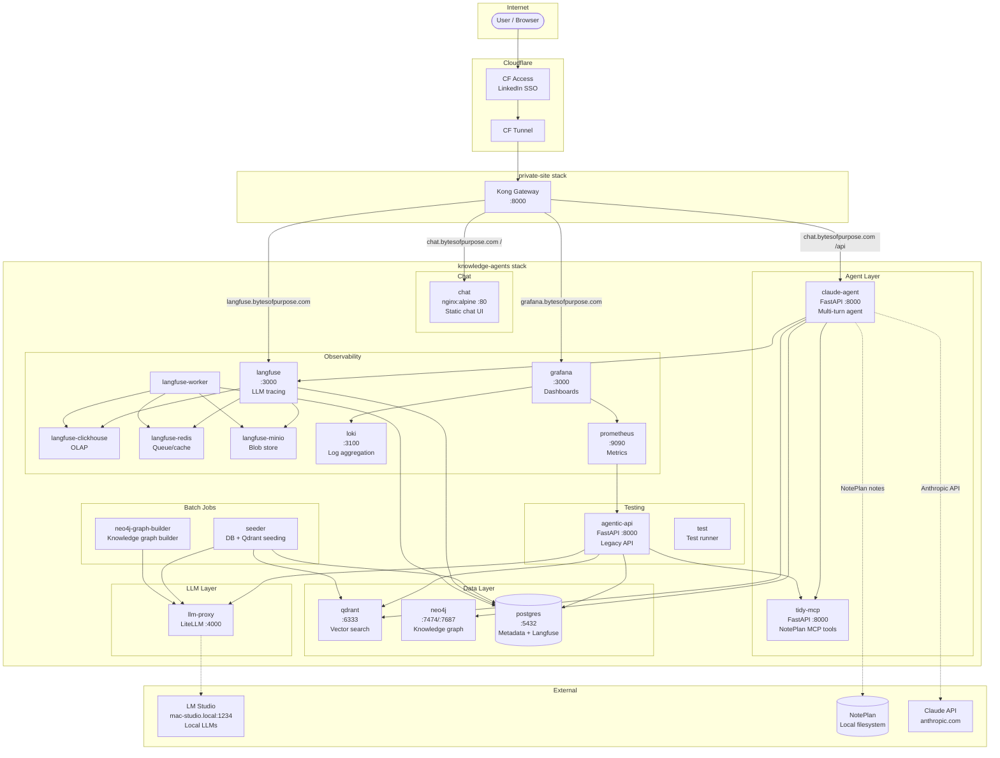

# Architecture

> **Living Document** — update when adding/removing containers, changing networks, or modifying routing (Kong, CF Tunnel).

## System Overview



## Hostname Routing

All subdomains route through **CF Access (LinkedIn SSO) -> CF Tunnel -> Kong**.

| Hostname | Kong Target | Container | Stack |
|----------|-------------|-----------|-------|
| `chat.bytesofpurpose.com /` | `http://chat:80` | `chat` (nginx) | knowledge-agents |
| `chat.bytesofpurpose.com /api` | `http://claude-agent:8000` | `claude-agent` | knowledge-agents |
| `langfuse.bytesofpurpose.com` | `http://langfuse:3000` | `langfuse` | knowledge-agents |
| `grafana.bytesofpurpose.com` | `http://grafana:3000` | `grafana` | knowledge-agents |
| `site.bytesofpurpose.com` | `http://site:80` | `site` | private-site |
| `plans.bytesofpurpose.com` | `http://plans-server:80` | `plans-server` | private-site |
| `art.bytesofpurpose.com` | `http://art-server:80` | `art-server` | private-site |
| `analytics.bytesofpurpose.com` | `http://umami:3000` | `umami` | private-site |
| `mcp.bytesofpurpose.com` | `http://mcp:8080` | `mcp` | private-site |

## Cross-Stack Networking

Containers in the knowledge-agents stack that need to be reachable from the private-site Kong must be connected to the `private-site_internal` Docker network:

```bash
make cross-network-connect   # Connect all (langfuse, chat, claude-agent)
make cross-network-check     # Verify all reachable from Kong
```

**Connection lost on container recreate.** `make deploy` runs `cross-network-connect` automatically post-deploy. If you recreate individual containers, re-run the connect target for that service.

| Service | Connect Command | Alias on private-site_internal |
|---------|----------------|-------------------------------|
| Langfuse | `make langfuse-connect` | `langfuse` |
| Chat UI | `make chat-connect` | `chat` |
| Claude Agent | `make claude-agent-connect` | `claude-agent` |

## Container Port Map

| Container | Internal Port | Host Port | Purpose |
|-----------|--------------|-----------|---------|
| postgres | 5432 | 5432 | Metadata DB + Langfuse DB |
| qdrant | 6333, 6334 | 6333, 6334 | Vector search (HTTP, gRPC) |
| neo4j | 7474, 7687 | 7474, 7687 | Graph DB (browser, Bolt) |
| llm-proxy | 4000 | 4000 | LiteLLM proxy |
| agentic-api | 8000 | 8001 | Legacy API |
| tidy-mcp | 8000 | 8003 | NotePlan MCP tools |
| claude-agent | 8000 | 8004 | Conversational agent |
| chat | 80 | 8080 | Chat UI (nginx) |
| prometheus | 9090 | 9090 | Metrics |
| grafana | 3000 | 3002 | Dashboards + Logs |
| loki | 3100 | 3100 | Log aggregation |
| langfuse | 3000 | 3210 | LLM tracing |
