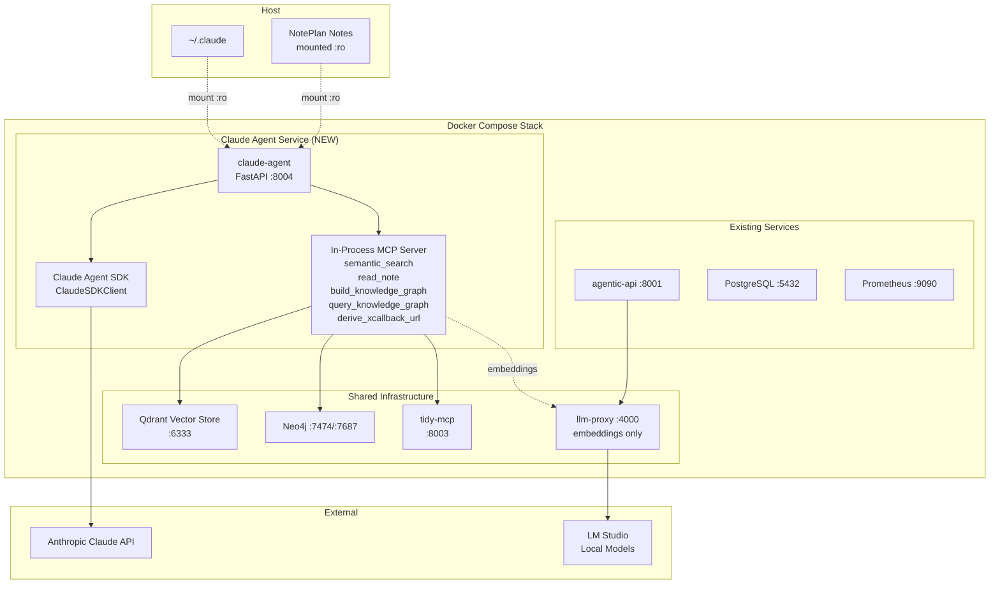
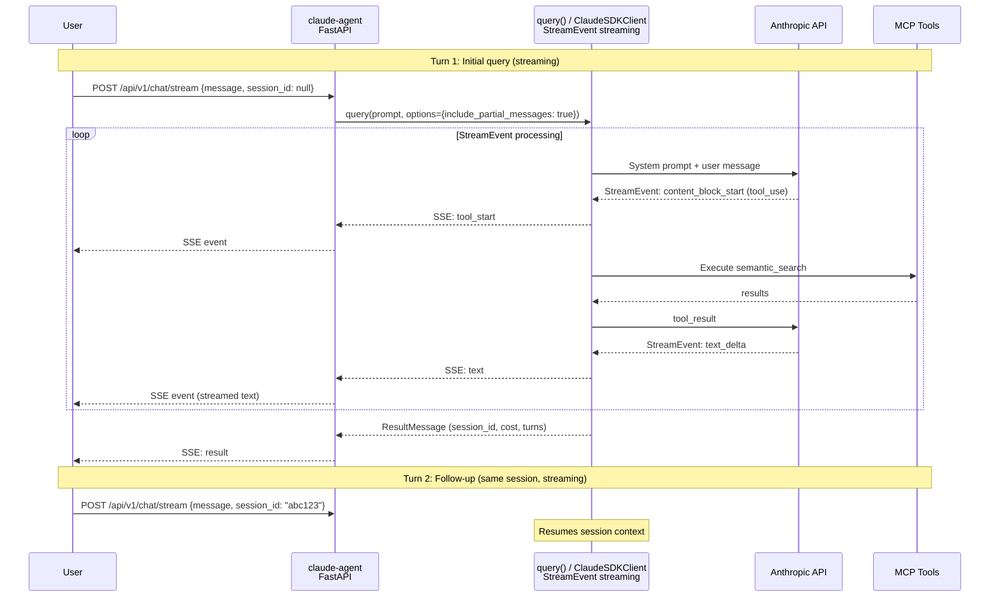
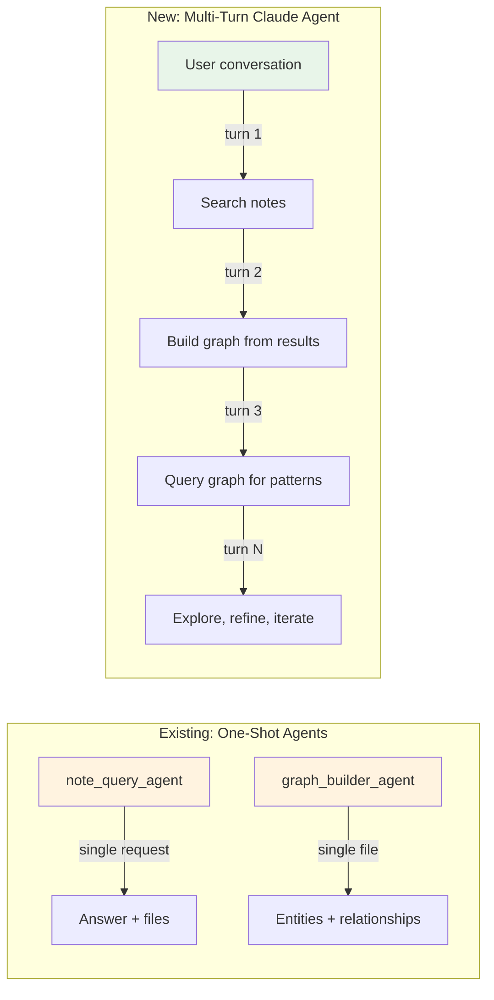
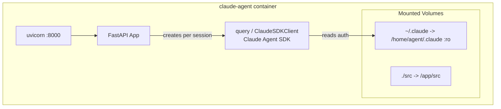

# Claude Agent Architecture

Multi-turn conversational Claude agent for interactive note search, knowledge graph building, and graph exploration.

## System Topology



## Multi-Turn Streaming Flow



## Comparison with Existing Agents



## Container Architecture



## Tools (5 Custom MCP Tools)

All defined via `@tool()` decorator, registered as in-process MCP server.

| Tool | Purpose | Reuses |
|------|---------|--------|
| `semantic_search(query, limit)` | Search notes via Qdrant | `query_vector_store.py` pattern |
| `read_note(file_path)` | Read note file content | `notes.parser.read_noteplan_file()` |
| `build_knowledge_graph(file_paths)` | Extract entities to Neo4j | `graph_utils.create_graph_nodes_and_relationships()` |
| `query_knowledge_graph(cypher_query)` | Query Neo4j graph | Direct Cypher execution |
| `derive_xcallback_url(file_path, heading)` | Generate NotePlan links | `noteplan_tools.py` pattern |

## Combined Vector + Graph Workflow

```
User: "What are my notes about machine learning connected to?"

Agent workflow:
1. semantic_search("machine learning") -> finds 5 relevant note files
2. read_note(top_result) -> reads the content
3. build_knowledge_graph([file1, file2, ...]) -> creates graph nodes/edges
4. query_knowledge_graph("MATCH (n:Note)-[:CONTAINS]->(e:Entity)
     WHERE n.file_path IN [...] RETURN e.name, e.type") -> entities in those notes
5. query_knowledge_graph("MATCH (e1:Entity)-[r]->(e2:Entity)
     WHERE e1.name IN [...] RETURN e1.name, type(r), e2.name") -> relationships
6. Synthesize answer about connections
```

## Session Workspace

Each agent session gets its own folder in `build/sessions/`:

```
build/sessions/{session_id}/
    session.json              # Session metadata
    turns/
        turn_001_prompt.md    # User message
        turn_001_response.md  # Agent response
        turn_001_tools.json   # Tool calls + results
    search_results/
        search_001.json       # Qdrant results
    graphs/
        extraction_001.json   # Entity/relationship extraction
        cypher_queries.log    # All Cypher queries executed
    eval/
        session_score.json    # Eval scores
```

## API Endpoints

| Endpoint | Method | Description |
|----------|--------|-------------|
| `/health` | GET | Health check |
| `/api/v1/chat` | POST | Send message, get full response (buffered) |
| `/api/v1/chat/stream` | POST | Send message, get SSE stream (real-time) |
| `/api/v1/sessions` | GET | List active sessions |
| `/api/v1/sessions/{id}` | DELETE | Close a session |
| `/api/v1/sessions/{id}/artifacts` | GET | List session files |

## Key Design Decisions

1. **Streaming-first with `StreamEvent`** -- Uses `query()` with `include_partial_messages=True` for real-time SSE streaming
2. **`query()` with `resume` for multi-turn** -- The SDK handles session state internally
3. **Agent-driven tool selection** -- Claude decides which tools to use based on conversation
4. **Neo4j CE containerized** -- Full Cypher support, zero migration cost from existing code
5. **Dual-store (Qdrant + Neo4j)** -- Vector search for discovery, graph for relationship traversal
6. **Reuse existing graph utilities** -- Entity extraction by Claude, storage via `graph_utils`
7. **Eval as first-class feature** -- Lives in `evals/`, separate from `tst/`
